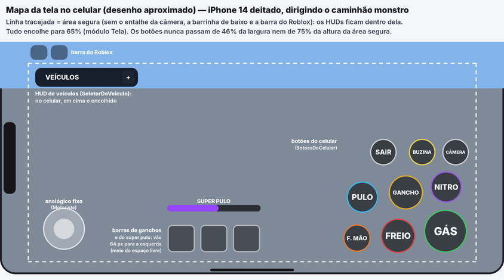

# Quadriciclo e Caminhão Monstro — scripts otimizados

Aqui estão **todos os scripts do seu jogo**, organizados igual ao Explorer do Roblox Studio, já com as
otimizações e correções. Este guia explica **o que mudou**, **por quê**, e **o passo a passo para
colocar no seu jogo**.

> Os seus scripts originais continuam guardados no histórico do repositório (commit
> *"Importa os scripts originais do jogo"*). Se algo der errado, dá para voltar a qualquer um deles.

---

## Atualização 3: celular sem nada cortado (+ diagnóstico)

**Por que ainda aparecia coisa cortada no celular:**

1. **O texto dos botões novos.** Eu tinha usado o `TextScaled` do Roblox (diminui o texto para caber).
   Só que, quando a caixa do texto é alta, ele prefere **quebrar a palavra no meio** para a letra
   ficar maior: "BUZIN A", "GANC HO". Agora o tamanho da letra é **medido** para caber numa linha só,
   sem `TextScaled` e sem quebrar linha.
2. **Os botões podiam passar da tela** em celular pequeno ou em pé. Agora eles ficam dentro da
   **área segura** (sem o entalhe da câmera, a barrinha de baixo do iPhone e a barra do Roblox) e nunca
   passam de 46% da largura nem de 75% da altura dela.
3. **O HUD de veículos aberto** podia passar da parte de baixo da tela em celulares baixos. Agora a lista
   mostra menos cartões (e rola) para o HUD inteiro caber.
4. **A Garagem** tinha um tamanho mínimo de 330 × 300 pixels, que cortava em celular de tela baixa. Agora,
   no celular, ela usa 92% × 86% da tela (cartões maiores) e nunca passa da tela. O botão SPAWNAR e os
   textos se ajustam ao espaço.
5. **A barra de ganchos e a barra do super pulo** (no meio, embaixo) podiam ficar embaixo dos botões em
   celulares estreitos. Agora elas vão para o meio do espaço livre entre o analógico e os botões.
6. **Celular em pé:** o tamanho dos HUDs agora vem do **lado menor** da tela (antes, só da altura).
7. Se os botões que você vê ainda são os **cinzas, redondos e amontoados** (como no seu primeiro print),
   algum script ainda é da versão antiga. O diagnóstico (abaixo) avisa isso no Output.

**Passo a passo no Studio:** troque **todos** estes, mesmo os que você já trocou nas atualizações
anteriores. Trocar de novo não faz mal e garante que nenhum ficou antigo.

1. **ReplicatedStorage › Compartilhado**
   - `ConfiguracaoPadrao` ← [ConfiguracaoPadrao.luau](src/ReplicatedStorage/Compartilhado/ConfiguracaoPadrao.luau)
   - `Tela` (ModuleScript; **crie** se não existir) ← [Tela.luau](src/ReplicatedStorage/Compartilhado/Tela.luau)
2. **ServerScriptService › QuadricicloServidor**
   - `Motorista` ← [Motorista.luau](src/ServerScriptService/QuadricicloServidor/Motorista.luau)
3. **StarterPlayer › StarterPlayerScripts** (LocalScripts)
   - `AvisosProgresso` ← [AvisosProgresso.client.luau](src/StarterPlayer/StarterPlayerScripts/AvisosProgresso.client.luau)
   - `GaragemCliente` ← [GaragemCliente.client.luau](src/StarterPlayer/StarterPlayerScripts/GaragemCliente.client.luau)
   - `SeletorDeVeiculo` ← [SeletorDeVeiculo.client.luau](src/StarterPlayer/StarterPlayerScripts/SeletorDeVeiculo.client.luau)
   - `DiagnosticoDaTela` (**novo** LocalScript) ← [DiagnosticoDaTela.client.luau](src/StarterPlayer/StarterPlayerScripts/DiagnosticoDaTela.client.luau)
4. **StarterPlayer › StarterPlayerScripts › QuadricicloCliente**
   - o próprio LocalScript `QuadricicloCliente` ← [init.client.luau](src/StarterPlayer/StarterPlayerScripts/QuadricicloCliente/init.client.luau)
   - `BotoesDoCelular` (ModuleScript; **crie** se não existir) ← [BotoesDoCelular.luau](src/StarterPlayer/StarterPlayerScripts/QuadricicloCliente/BotoesDoCelular.luau)
   - [`Buzina`](src/StarterPlayer/StarterPlayerScripts/QuadricicloCliente/Buzina.luau) · [`Camera`](src/StarterPlayer/StarterPlayerScripts/QuadricicloCliente/Camera.luau) · [`FreioDeMao`](src/StarterPlayer/StarterPlayerScripts/QuadricicloCliente/FreioDeMao.luau) ·
     [`Gancho`](src/StarterPlayer/StarterPlayerScripts/QuadricicloCliente/Gancho.luau) · [`Monstro`](src/StarterPlayer/StarterPlayerScripts/QuadricicloCliente/Monstro.luau) · [`Nitro`](src/StarterPlayer/StarterPlayerScripts/QuadricicloCliente/Nitro.luau) ·
     [`Pista`](src/StarterPlayer/StarterPlayerScripts/QuadricicloCliente/Pista.luau) · [`Velocimetro`](src/StarterPlayer/StarterPlayerScripts/QuadricicloCliente/Velocimetro.luau)

**Testar com o diagnóstico (o `DiagnosticoDaTela` só funciona no Studio):**

1. *Test › Device*: escolha um celular (por exemplo, iPhone 14, iPhone SE ou um Galaxy), **deitado**.
2. Dê Play e abra o Output (*View › Output*).
3. Aparece uma linha como `[Tela] 844 × 390 pixels (área segura 750 × 354) · jogando com: Touch ·
   tamanho dos HUDs: 0.65`. Uns segundos depois:
   - `[Tela] Nada cortado nesta tela.` = tudo certo;
   - ou linhas **amarelas** dizendo **o que** está cortado. Por exemplo: um HUD que passa da borda, um
     texto que não cabe, um botão do celular em cima do seu `HUDQuadriciclo` ou "botões AUTOMÁTICOS do
     Roblox na tela" (script antigo).
4. **Sente num veículo** e olhe de novo: os botões só aparecem dirigindo.
5. Troque de aparelho (e gire a tela) para testar outros tamanhos. Cada troca escreve o tamanho novo e
   confere tudo de novo.
6. Se algo continuar cortado, me mande as linhas amarelas (ou um print) que eu arrumo.

Para conferir se os botões novos estão rodando: com o Play ligado no emulador, abra no Explorer
**Players › (seu nome) › PlayerGui**. Deve ter **BotoesDoCelular**. Se tiver **ContextActionGui** com
botões dentro, algum script ainda cria os botões automáticos (é da versão antiga).

> O emulador mostra o **tamanho** da tela, mas não a **velocidade** de um celular de verdade. De vez em
> quando, teste também no seu celular, com o app do Roblox.

---

## Como o jogo funciona no celular (para entender)



A tela do celular tem **4 camadas**:

1. **Os controles do Roblox** (o "PlayerModule", que já vem no jogo): o **analógico** e o **botão de
   pulo**.
   - Andando: é o analógico normal do Roblox, que aparece onde você encosta o dedo.
   - Dirigindo: o `Motorista` (no servidor) troca para o analógico **fixo**, parado no canto
     (`AnalogicoFixoNoCelular` na `ConfiguracaoPadrao`). O `BotoesDoCelular` **esconde o botão de pulo**
     (ele tirava você do veículo sem querer). Ao sair do veículo, os dois voltam ao normal.
2. **Os botões de ação** (`BotoesDoCelular`): GÁS, FREIO, GANCHO, NITRO, F. MÃO, PULO, SAIR, BUZINA e
   CÂMERA. Cada ação do veículo é ligada **uma vez só**: o teclado e o controle continuam no
   `ContextActionService`, e o botão da tela é desenhado pelo `BotoesDoCelular`. Os botões automáticos
   do Roblox **não são mais usados**: ficavam amontoados, o texto quebrava e cabiam no máximo 7.
   - Mudar lugar, tamanho ou cor de um botão: tabela `BOTOES`, no começo do `BotoesDoCelular`.
3. **Os HUDs** (cada um é uma `ScreenGui`): velocímetro, barra de ganchos, HUD de veículos, Garagem,
   avisos. Todos ficam dentro da **área segura** da tela (a linha tracejada no desenho).
   - O módulo `Tela` decide o **tamanho** (com um `UIScale`): 1 no computador, 0,65 num celular e no
     máximo 0,85 num tablet.
   - Quer tudo maior ou menor no celular? Mude `TAMANHO_TELA_PEQUENA` no `Tela`. Vale para todos os
     HUDs de uma vez.
4. **Os efeitos** (riscos de velocidade, "PERFEITO!", "MORTAL!"): ficam por cima do jogo e somem sozinhos.

**Como o jogo sabe que é celular?** `Tela.noToque()` pergunta ao Roblox como a pessoa está jogando
**agora** (`UserInputService.PreferredInput`: toque, controle ou teclado e mouse). Se alguém liga um
controle no celular, os botões da tela somem e o controle passa a valer. Se desliga, eles voltam.

**Regra de ouro para textos no celular:** só use `TextScaled` numa caixa da altura de **uma linha**.
Numa caixa alta, ele quebra a palavra no meio. Para uma caixa grande, escolha o tamanho da letra (ou meça
com `TextService:GetTextSize`, como no `BotoesDoCelular`). O diagnóstico avisa quando um texto não cabe.

| Script | O que ele faz no celular |
|---|---|
| `Tela` (ModuleScript) | Tamanho dos HUDs em cada tela, e se é toque ou controle |
| `BotoesDoCelular` (ModuleScript) | Os botões de dirigir e o botão de pulo escondido |
| `Motorista` (servidor) | O analógico fixo enquanto dirige |
| `SeletorDeVeiculo` | O HUD de veículos fica em cima, encolhido, e cabe em tela baixa |
| `GaragemCliente` | A Garagem usa quase a tela toda e nunca passa dela |
| `Gancho` e `Monstro` | As barras do meio vão para o espaço livre entre o analógico e os botões |
| `DiagnosticoDaTela` | Só no Studio: escreve no Output o que está cortado ou um em cima do outro |

---

## Atualização 2: botões do celular

Os botões de toque de antes (GÁS, FREIO, NITRO...) eram os **automáticos do Roblox**: ficavam amontoados
em cima do botão de pulo, o texto não cabia ("BUZIN A") e o Roblox mostra **no máximo 7**, então o
**SAIR** e o **PULO** do caminhão monstro nem apareciam. Agora os botões são **nossos**:

- Cada botão tem o seu lugar, tamanho e cor, no canto de baixo à direita: o **GÁS** é o maior e fica no
  canto; **FREIO**, **GANCHO** e **NITRO** em volta dele; **F. MÃO** e **PULO** (só no caminhão monstro)
  mais para a esquerda; **SAIR**, **BUZINA** e **CÂMERA** menores, em cima (longe do GÁS, para ninguém
  sair do veículo sem querer).
- Se o dedo escorregar para fora do botão, ele **continua apertado** até você tirar o dedo da tela.
- **Dirigindo, o botão de pulo do Roblox some** (ele tirava você do veículo sem querer, colado no GÁS).
  Para sair, use o botão **SAIR**. Quando você sai do veículo, o pulo volta.
- Os botões encolhem junto com os outros HUDs (módulo `Tela`).
- Teclado e controle continuam **exatamente iguais**.

**Passo a passo no Studio** (já está incluído na lista completa da **Atualização 3**, acima):

1. Em **StarterPlayer › StarterPlayerScripts › QuadricicloCliente**, **crie** um ModuleScript:
   - `BotoesDoCelular` ← [BotoesDoCelular.luau](src/StarterPlayer/StarterPlayerScripts/QuadricicloCliente/BotoesDoCelular.luau)
2. **Substitua** (apague tudo e cole o novo), todos dentro de StarterPlayerScripts:
   - `QuadricicloCliente` (o LocalScript) ← [init.client.luau](src/StarterPlayer/StarterPlayerScripts/QuadricicloCliente/init.client.luau)
   - QuadricicloCliente › `Buzina` ← [Buzina.luau](src/StarterPlayer/StarterPlayerScripts/QuadricicloCliente/Buzina.luau)
   - QuadricicloCliente › `Camera` ← [Camera.luau](src/StarterPlayer/StarterPlayerScripts/QuadricicloCliente/Camera.luau)
   - QuadricicloCliente › `FreioDeMao` ← [FreioDeMao.luau](src/StarterPlayer/StarterPlayerScripts/QuadricicloCliente/FreioDeMao.luau)
   - QuadricicloCliente › `Gancho` ← [Gancho.luau](src/StarterPlayer/StarterPlayerScripts/QuadricicloCliente/Gancho.luau)
   - QuadricicloCliente › `Monstro` ← [Monstro.luau](src/StarterPlayer/StarterPlayerScripts/QuadricicloCliente/Monstro.luau)
   - QuadricicloCliente › `Nitro` ← [Nitro.luau](src/StarterPlayer/StarterPlayerScripts/QuadricicloCliente/Nitro.luau)
3. **Teste:** *Test › Device*, escolha um celular **deitado** e dê Play. Sente no quadriciclo e no
   caminhão monstro: os botões aparecem organizados, o botão de pulo do Roblox some, e o SAIR tira você
   do veículo. Confira também se nenhum botão ficou em cima de algo do seu **HUDQuadriciclo** (o
   velocímetro do StarterGui): se ficou, mude o HUD de lugar ou mexa nos botões (abaixo).

**Quer mudar um botão de lugar, de tamanho ou de cor?** No começo do `BotoesDoCelular` tem a tabela
`BOTOES`: `x` e `y` são o centro do botão, `tamanho` é a largura. Todos ficam num quadro de 330 × 300
no canto de baixo à direita (no celular, tudo encolhe junto).

---

## Atualização: celular e controle

(Os arquivos desta atualização já estão na lista completa da **Atualização 3**, lá em cima: siga aquela
lista. Esta seção fica aqui para explicar o que mudou.)

**O que muda:**
- **HUD menor no celular.** Os HUDs (velocímetro, barra do gancho, barra do super pulo, os textos
  grandes como "PERFEITO!" e "CHECKPOINT 2!", e o HUD de veículos) ficam **menores em telas pequenas**.
  No computador fica tudo igual (só diminui um pouco se a janela for bem pequena). Quem decide o tamanho é um módulo novo, o **Tela**: ele também acerta
  sozinho quando o celular gira ou a janela muda de tamanho.
- **Controle (videogame) na Garagem.** Antes não dava para escolher nem chamar um veículo com o controle.
  Agora: **X** abre a garagem (como já era) › **◀ ▶** (ou o analógico) escolhem o cartão ›
  **A** chama o veículo › **B** fecha.
- **Controle no HUD de veículos** (o do canto da tela), andando a pé: **◀ ▶** escolhem o veículo,
  **▲** aperta o botão grande (chamar), **▼** esconde/abre o HUD. Uma dica aparece no HUD quando você
  está jogando com controle.
- **Super pulo do caminhão monstro no controle agora é o A.** Antes era o **Y**, mas o Y já trocava a
  câmera, então **o super pulo nunca funcionava no controle**. (Para sair do veículo: **X**.)
- **Analógico parado no celular enquanto dirige.** Dirigindo, o analógico do celular vira o
  **clássico, fixo no canto de baixo**, em vez de aparecer onde o dedo encosta. Quando você sai do
  veículo, volta a ser o de antes. Dá para desligar em `ConfiguracaoPadrao`:
  `AnalogicoFixoNoCelular = false`.

**Passo a passo no Studio:**

1. Em **ReplicatedStorage › Compartilhado**, **crie** um ModuleScript:
   - `Tela` ← [src/ReplicatedStorage/Compartilhado/Tela.luau](src/ReplicatedStorage/Compartilhado/Tela.luau)
2. **Substitua** (apague tudo e cole o novo):
   - ReplicatedStorage › Compartilhado › `ConfiguracaoPadrao` ← [ConfiguracaoPadrao.luau](src/ReplicatedStorage/Compartilhado/ConfiguracaoPadrao.luau)
   - ServerScriptService › QuadricicloServidor › `Motorista` ← [Motorista.luau](src/ServerScriptService/QuadricicloServidor/Motorista.luau)
   - StarterPlayerScripts › `QuadricicloCliente` (o LocalScript) ← [init.client.luau](src/StarterPlayer/StarterPlayerScripts/QuadricicloCliente/init.client.luau)
   - StarterPlayerScripts › QuadricicloCliente › `Velocimetro` ← [Velocimetro.luau](src/StarterPlayer/StarterPlayerScripts/QuadricicloCliente/Velocimetro.luau)
   - StarterPlayerScripts › QuadricicloCliente › `Gancho` ← [Gancho.luau](src/StarterPlayer/StarterPlayerScripts/QuadricicloCliente/Gancho.luau)
   - StarterPlayerScripts › QuadricicloCliente › `Monstro` ← [Monstro.luau](src/StarterPlayer/StarterPlayerScripts/QuadricicloCliente/Monstro.luau)
   - StarterPlayerScripts › QuadricicloCliente › `Pista` ← [Pista.luau](src/StarterPlayer/StarterPlayerScripts/QuadricicloCliente/Pista.luau)
   - StarterPlayerScripts › `AvisosProgresso` ← [AvisosProgresso.client.luau](src/StarterPlayer/StarterPlayerScripts/AvisosProgresso.client.luau)
   - StarterPlayerScripts › `GaragemCliente` ← [GaragemCliente.client.luau](src/StarterPlayer/StarterPlayerScripts/GaragemCliente.client.luau)
   - StarterPlayerScripts › `SeletorDeVeiculo` ← [SeletorDeVeiculo.client.luau](src/StarterPlayer/StarterPlayerScripts/SeletorDeVeiculo.client.luau)
3. **Teste:**
   - **Celular:** *Test › Device* (o emulador do Studio), escolha um celular (ex.: iPhone) **deitado** e
     dê Play. Os HUDs devem estar menores. Sente num veículo: o analógico fica parado no canto de baixo
     à esquerda; saia: ele volta ao normal.
   - **Controle:** ligue um controle (Xbox/PlayStation) no computador e dê Play. Perto do spawner, **X**
     abre a garagem; ◀ ▶ trocam; **A** chama; **B** fecha. A pé, longe do spawner, ◀ ▶ / ▲ / ▼ mexem no
     HUD de veículos. No caminhão monstro, segure **A** para o super pulo.

**Quer os HUDs ainda menores (ou maiores) no celular?** No módulo `Tela`, mude
`TAMANHO_TELA_PEQUENA` (hoje `0.65` = 65% do tamanho do computador). Vale para todos os HUDs de uma vez.

**Quer o analógico parado também andando a pé?** No Studio: **StarterPlayer** › Propriedades ›
`DevTouchMovementMode` = **Thumbstick**. (Os scripts só mudam isso enquanto a pessoa dirige.)

> **Celular:** os botões automáticos do Roblox (no máximo 7, e sem o PULO do caminhão monstro) foram
> trocados por botões próprios na **Atualização 2**, logo acima.

---

## Resumo rápido

| Antes | Agora |
|---|---|
| Um script **Servidor** de 1.346 linhas **dentro de cada veículo** (os dois eram cópias idênticas) | Um script só: **ServerScriptService › QuadricicloServidor**, dividido em 4 módulos. Os veículos não têm mais nenhum script. |
| Cada veículo com uma **Configuracao** de 228 linhas (iguais, menos 7 valores) | **ReplicatedStorage › Compartilhado › ConfiguracaoPadrao** com tudo (e a explicação de cada valor). Cada veículo só lista o que muda. |
| ZonasSemGancho + ZonasSemImpulso | Um script só: **Zonas** |
| Garagem e HUD de veículos com o mesmo código copiado | Módulo compartilhado **Vitrine** |

**Bugs corrigidos** (detalhes mais abaixo):
1. Chamar outro veículo pelo HUD **enquanto dirigia** deixava o personagem sem peso e **atravessando
   os veículos** até renascer.
2. O freio de mão tinha duas "faíscas" com o mesmo nome: as **estrelinhas com luz nunca apareciam** e
   as faíscas antigas (7× mais partículas) apareciam no lugar.
3. Ao sair do caminhão, a "leveza no ar", o "grudar no loop" e a inclinação das molas **continuavam
   agindo por 1 segundo**.
4. O **Checkpoint 1** do mapa tem o atributo `Numero` como **texto** (`"1"`), então ele **nunca
   funcionava**. A **Moeda** tem `Valor` como texto (`"1555"`), então valia só 1.
5. O gancho conseguia **prender na tábua invisível** (enquanto ela espera para voltar).
6. Sons com o ID vazio (`"rbxassetid://"`) faziam o Roblox tentar carregar um som que não existe.

Todos os scripts foram conferidos com o verificador de tipos do Luau (a mesma checagem que o Studio
faz no modo `--!strict`): **0 erros**. E testei a lógica que dá para testar fora do Roblox (por
exemplo: **os 125 valores de ajuste de cada veículo continuam exatamente iguais** aos seus). A física
de verdade só dá para testar no Studio: por isso o checklist do passo 5.

---

## Passo a passo para colocar no seu jogo

> **Antes de tudo:** *File › Save to File As...* e salve uma cópia do seu jogo (`.rbxl`).
> Assim você tem um "ponto de volta" garantido.

Para **substituir** um script: clique duas vezes nele, apague tudo (Ctrl+A, Delete) e cole o código
novo deste repositório. Para **criar**: botão direito no lugar › *Insert Object* › escolha o tipo
(**Script**, **LocalScript**, **ModuleScript** ou **Folder**) e renomeie **exatamente** como está aqui
(maiúsculas contam, sem acento).

Os arquivos daqui seguem o padrão do Rojo:
`.server.luau` = **Script** · `.client.luau` = **LocalScript** · `.luau` = **ModuleScript** ·
uma pasta com `init.server.luau` dentro = o **Script** daquela pasta, com os outros arquivos como filhos.

### 1) ReplicatedStorage

1. **Crie** a pasta `Compartilhado` (Folder) dentro do ReplicatedStorage.
2. Dentro dela, **crie** dois ModuleScripts:
   - `ConfiguracaoPadrao` ← [src/ReplicatedStorage/Compartilhado/ConfiguracaoPadrao.luau](src/ReplicatedStorage/Compartilhado/ConfiguracaoPadrao.luau)
   - `Vitrine` ← [src/ReplicatedStorage/Compartilhado/Vitrine.luau](src/ReplicatedStorage/Compartilhado/Vitrine.luau)
3. Em `Quadriciclos › Quadriciclo › Scripts`:
   - **Substitua** a `Configuracao` ← [Quadriciclo/Scripts/Configuracao.luau](src/ReplicatedStorage/Quadriciclos/Quadriciclo/Scripts/Configuracao.luau)
   - **Apague** o script `Servidor`.
4. Em `Quadriciclos › CaminhaoMonstro › Scripts`:
   - **Substitua** a `Configuracao` ← [CaminhaoMonstro/Scripts/Configuracao.luau](src/ReplicatedStorage/Quadriciclos/CaminhaoMonstro/Scripts/Configuracao.luau)
   - **Apague** o script `Servidor`.

> Esqueceu de apagar um `Servidor`? Tudo bem: o QuadricicloServidor percebe, avisa no Output e deixa
> o script antigo cuidando daquele veículo (os dois juntos brigariam).

### 2) ServerScriptService

1. **Crie** um **Script** chamado `QuadricicloServidor` ← [QuadricicloServidor/init.server.luau](src/ServerScriptService/QuadricicloServidor/init.server.luau)
2. **Dentro dele**, crie 4 **ModuleScripts**:
   - `Montagem` ← [QuadricicloServidor/Montagem.luau](src/ServerScriptService/QuadricicloServidor/Montagem.luau)
   - `Motorista` ← [QuadricicloServidor/Motorista.luau](src/ServerScriptService/QuadricicloServidor/Motorista.luau)
   - `Gancho` ← [QuadricicloServidor/Gancho.luau](src/ServerScriptService/QuadricicloServidor/Gancho.luau)
   - `Pancada` ← [QuadricicloServidor/Pancada.luau](src/ServerScriptService/QuadricicloServidor/Pancada.luau)
3. **Apague** `ZonasSemGancho` e `ZonasSemImpulso` e **crie** um Script `Zonas` ← [Zonas.server.luau](src/ServerScriptService/Zonas.server.luau)
4. **Substitua** o conteúdo de:
   - `Progresso` ← [Progresso.server.luau](src/ServerScriptService/Progresso.server.luau)
   - `Spawner` ← [Spawner.server.luau](src/ServerScriptService/Spawner.server.luau)
   - `TabuasQueCaem` ← [TabuasQueCaem.server.luau](src/ServerScriptService/TabuasQueCaem.server.luau)

### 3) StarterPlayer › StarterPlayerScripts

1. **Substitua** o próprio LocalScript `QuadricicloCliente` ← [QuadricicloCliente/init.client.luau](src/StarterPlayer/StarterPlayerScripts/QuadricicloCliente/init.client.luau)
2. Dentro dele, **substitua** estes 9 ModuleScripts (os outros 4 — `Camera`, `Buzina`, `Ladeira` e
   `TeclasMenu` — **não mudaram**):
   [`Veiculo`](src/StarterPlayer/StarterPlayerScripts/QuadricicloCliente/Veiculo.luau) ·
   [`Velocimetro`](src/StarterPlayer/StarterPlayerScripts/QuadricicloCliente/Velocimetro.luau) ·
   [`Nitro`](src/StarterPlayer/StarterPlayerScripts/QuadricicloCliente/Nitro.luau) ·
   [`FreioDeMao`](src/StarterPlayer/StarterPlayerScripts/QuadricicloCliente/FreioDeMao.luau) ·
   [`Gancho`](src/StarterPlayer/StarterPlayerScripts/QuadricicloCliente/Gancho.luau) ·
   [`BoostPads`](src/StarterPlayer/StarterPlayerScripts/QuadricicloCliente/BoostPads.luau) ·
   [`Sensacao`](src/StarterPlayer/StarterPlayerScripts/QuadricicloCliente/Sensacao.luau) ·
   [`Monstro`](src/StarterPlayer/StarterPlayerScripts/QuadricicloCliente/Monstro.luau) ·
   [`Pista`](src/StarterPlayer/StarterPlayerScripts/QuadricicloCliente/Pista.luau)
3. **Substitua** os LocalScripts:
   [`AvisosProgresso`](src/StarterPlayer/StarterPlayerScripts/AvisosProgresso.client.luau) ·
   [`GaragemCliente`](src/StarterPlayer/StarterPlayerScripts/GaragemCliente.client.luau) ·
   [`SeletorDeVeiculo`](src/StarterPlayer/StarterPlayerScripts/SeletorDeVeiculo.client.luau)

### 4) Arrumações no mapa (no Studio, sem script)

| O quê | Onde | Por quê |
|---|---|---|
| `Numero` do **Checkpoint 1** está como texto `"1"` | Properties › Attributes: apague e crie de novo como **number** = 1 | Os scripts novos aceitam texto (e avisam no Output), mas o certo é number. |
| `Valor` da **Moeda** está como texto `"1555"` | Mesma coisa, como **number**. **Confira o valor**: antes ele era ignorado (a moeda dava 1); agora ela dá **1555**. | |
| `hoop_blue` com **Anchored = false** | Marque **Anchored** | Ele cai quando o jogo começa (e fica simulando física à toa). |
| 4 peças `default_googly_*` **dentro do Terrain** | Apague | Sobra de algum plugin/modelo da Toolbox (com SpotLights desligadas). |
| `StarterGui › HUD_Backup` (desativado) | Apague (ou guarde no ServerStorage) | Toda ScreenGui do StarterGui é copiada para cada jogador, mesmo desativada. |
| Fogo do nitro aceso no molde (`SaidaNitro › Miolo` e `Chama`, **Enabled = true**) | Desmarque **Enabled** nos dois veículos | O código já apaga, mas no molde aceso ele "pisca" quando o veículo aparece. |

Dica: dá para corrigir os atributos de texto de uma vez pela **Command Bar** (*View › Command Bar*):

```lua
for _, tag in { "Checkpoint", "Moeda" } do
	for _, peca in game:GetService("CollectionService"):GetTagged(tag) do
		for _, nome in { "Numero", "Valor" } do
			local valor = peca:GetAttribute(nome)
			if typeof(valor) == "string" and tonumber(valor) then
				peca:SetAttribute(nome, nil)
				peca:SetAttribute(nome, tonumber(valor))
				print("Corrigido:", peca:GetFullName(), nome, "=", valor)
			end
		end
	end
end
```

### 5) Teste (Play)

Abra o **Output** (*View › Output*) e confira:

- [ ] Nada em **vermelho** ao dar Play. (Se aparecer, a mensagem explica o que está faltando ou com nome errado.)
- [ ] Chamar o quadriciclo e o caminhão pela **Garagem (E)** e pelo **HUD (CHAMAR)**: você senta sozinho.
- [ ] Dirigir, nitro (Shift), buzina (H), câmera (C), desvirar (R).
- [ ] **Freio de mão** (Espaço) andando rápido: agora saem as **estrelinhas amarelas com luz** (antes eram faíscas laranja).
- [ ] Os 3 ganchos (1/2/3 + botão direito/esquerdo do mouse), dentro e fora das zonas.
- [ ] **Checkpoint 1**: aparece "CHECKPOINT 1!" e você renasce nele.
- [ ] **Moeda**, **tábuas que caem**, **boost pad**, **loop/tubo** com o caminhão.
- [ ] **O bug antigo:** dirigindo perto de um spawner, aperte **CHAMAR** (troca de veículo). Depois saia
      do veículo: o personagem deve **colidir normalmente** com os veículos (antes ele atravessava).

**Se aparecer no Output:**

| Mensagem | O que fazer |
|---|---|
| `Infinite yield possible on 'ReplicatedStorage:WaitForChild("Compartilhado")'` | Faltou o passo 1: a pasta `Compartilhado` com `ConfiguracaoPadrao` e `Vitrine`. |
| `Infinite yield possible on '...QuadricicloServidor:WaitForChild("Montagem")'` (ou Motorista, Gancho, Pancada) | Os 4 módulos precisam ficar **dentro** do Script `QuadricicloServidor`, com o nome certinho. |
| `"Quadriciclo" ainda tem o script "Servidor" dentro` | Apague o `Servidor` de dentro daquele veículo (passo 1). |
| `[Configuracao] ...: "MaxTorqe" não existe` | Erro de digitação na Configuracao do veículo: o nome certo está na `ConfiguracaoPadrao`. |
| `[Progresso] ... atributo "Numero" como TEXTO` | Passo 4 (ou o comando da Command Bar). |
| `Falta o ModuleScript "..." dentro do QuadricicloCliente` | Confira o nome do ModuleScript (maiúsculas contam, sem acento). |
| Uma mensagem em vermelho começando com `[Quadriciclo]` | É a conferência da montagem do veículo (igual à de antes): ela diz qual peça ou Attachment está errado. |

---

## O que mudou em cada script (e por quê)

### Servidor

**QuadricicloServidor** (novo, substitui os dois `Servidor`)
- **Um script para todos os veículos.** Antes, cada veículo que aparecia carregava a própria cópia
  de 1.346 linhas. Agora o código existe uma vez só; um veículo novo não precisa de script nenhum.
- Ele **acha os veículos sozinho**: os da pasta `QuadriciclosDosJogadores` (do Spawner) e os que você
  colocar direto no mapa pelo Studio. No fim, põe a tag `Quadriciclo` (o sinal de "pronto!").
- Dividido em módulos: **Montagem** (confere a montagem e aplica a Configuracao — com as mesmas
  mensagens de erro em português de antes), **Motorista** (banco, dono da física, buzina/nitro/sair),
  **Gancho** e **Pancada**.
- **Um "porteiro" só** para o RemoteEvent de cada veículo (antes eram 4 funções ouvindo o mesmo evento)
  e **anti-spam**: cada jogador pode mandar até 30 ações por segundo (um trapaceiro mandando
  milhares é ignorado, e não enche a internet dos outros jogadores com buzina liga/desliga).
- A velocidade usada na "pancada" só é acompanhada nos veículos **com motorista** (antes: todo
  veículo, a cada frame, para sempre).
- Buzina/nitro/derrapagem só mudam o atributo quando o valor muda de verdade.
- **Correção do personagem "fantasma"**: quando o veículo era apagado com você dentro (ex.: chamar
  outro pelo HUD), o script dele morria junto e o personagem ficava **sem massa e no grupo de colisão
  do piloto** (atravessando rodas e chassis). Agora o estado original é guardado à parte e sempre
  devolvido.
- Os Collision Groups são registrados **uma vez** (antes, a cada veículo que aparecia).

**ConfiguracaoPadrao** (novo) + **Configuracao** de cada veículo
- Todos os ajustes num lugar só, **com a explicação de cada um**. A Configuracao do veículo agora só
  tem o que é diferente (a do caminhão tem 7 linhas: motor, direção e molas).
- Os ajustes que estavam **escondidos dentro dos scripts** (ex.: `BalancoGravidade`, `CameraDescer`,
  `FreioDeMaoGiroMaximo`, `NitroPancada`...) agora aparecem na ConfiguracaoPadrao, com o mesmo valor.
- Escreveu um nome errado (`MaxTorqe`) ou um tipo errado (texto no lugar de número)? **O Output avisa.**
- IDs de som vazios (`"rbxassetid://"`) viram `""` (sem som).
- `GanchoBalancoForca` e `GanchoBalancoVelocidadeMaxima` saíram: **nenhum script usava** (o balanço
  usa os `Balanco...`).

**Spawner** — senta você **assim que o veículo fica pronto** (espera a tag), em vez de esperar 0,5 s fixos.

**Zonas** — junta `ZonasSemGancho` e `ZonasSemImpulso`. Novidade: a `ZonaSemImpulso` também aceita o
atributo `Visivel`.

**Progresso**
- Salva com `UpdateAsync` (o jeito recomendado pelo Roblox), **tenta 3 vezes** se falhar, **nunca
  salva o mesmo jogador duas vezes ao mesmo tempo** (antes, ao fechar o servidor, podia acontecer) e
  **não salva quando nada mudou** (economiza o limite do DataStore).
- Aceita `Numero`/`Valor` escritos como texto, e avisa no Output.
- Os bancos de cada veículo são procurados uma vez só (antes, a cada toque numa moeda, ele olhava as
  100+ peças do caminhão).

**TabuasQueCaem** — enquanto a tábua está invisível, os raios atravessam (o gancho não prende mais nela).

### Cliente (QuadricicloCliente e HUDs)

- **FreioDeMao**: correção das faíscas duplicadas (veja acima); o atrito das rodas muda de 0,01 em 0,01
  (poucas vezes por segundo em vez de todo frame: trocar o atrito de uma peça é "caro" para a física);
  um quique de 1 frame no ar não apaga e acende a fumaça (e não manda aviso ao servidor).
- **Sensacao, Monstro e Pista**: desligam **na hora** que você sai do banco; as câmeras deles só rodam
  enquanto alguém dirige; o `print` das molas só aparece no `DEBUG_MODE`.
- **Gancho**: a lista das zonas fica guardada (antes, a cada frame, ele procurava **todas as zonas do
  mapa e todas as peças delas**, várias vezes por frame — num mapa grande isso pesa); os "filtros" dos
  raios são criados uma vez quando você senta (antes: vários por frame).
- **BoostPads** e **moedas**: só animam os que estão **perto da câmera** (300 studs); as moedas giram
  todas de uma vez com `workspace:BulkMoveTo` (bem mais rápido que uma por uma).
- **Velocímetro** e **barra do nitro**: só mexem na tela quando o valor muda.
- **Vitrine** (novo, compartilhado): a Garagem e o HUD de veículos usam o mesmo código. A cópia 3D do
  veículo nos cartões tira scripts, sons, luzes, partículas e constraints (que nem aparecem numa
  ViewportFrame). O veículo escolhido no HUD gira redesenhando 30 vezes por segundo (o do mouse em
  cima continua liso). A Garagem agora mostra o nome/descrição certos do caminhão e a mesma ordem do HUD.

---

## Como criar um veículo novo agora

1. Copie um veículo da pasta `ReplicatedStorage › Quadriciclos` e renomeie.
2. Mude o visual à vontade (mantendo `Chassi`, `Banco`, `Rodas` e a pasta `Scripts`).
3. Na `Configuracao` dele, escreva **só o que muda**, por exemplo:
   ```lua
   return Padrao.criar({
       MaxSpeed = 55,
       NitroDuration = 4,
   })
   ```
4. Atributos do Model: `NomeExibido`, `Descricao` e `Ordem` (a posição do cartão).

Pronto: ele aparece na Garagem e no HUD, e o QuadricicloServidor cuida dele. Nenhum script para copiar.

---

## Recomendações para o mapa de verdade

1. **StreamingEnabled** (Workspace) num mapa grande: o jogador só carrega o que está perto. Os veículos
   já usam `ModelStreamingMode = Atomic`. Coloque **`ModelStreamingMode = Persistent` nos Models dos
   Spawners**: assim a bússola e o "MOSTRAR CAMINHO" do HUD acham spawners longe.
2. **Pedras e enfeites** em que ninguém encosta: `CanCollide`, `CanTouch` e `CanQuery` desligados e
   `CollisionFidelity = Box`. As que o veículo encosta (passa por cima ou bate): `Hull`. Ancore tudo
   que não precisa de física (as pedras de `ServerStorage › Pedras › _Importadas` estão desancoradas).
3. **Peças pequenas sem sombra**: o caminhão tem dezenas de enfeites pequenos (cravos, parafusos,
   estrelas). Sombra de peça pequena quase não aparece e custa. Para desligar nos moldes (Command Bar):
   ```lua
   for _, molde in game:GetService("ReplicatedStorage").Quadriciclos:GetChildren() do
       for _, peca in molde:GetDescendants() do
           if peca:IsA("BasePart") and math.max(peca.Size.X, peca.Size.Y, peca.Size.Z) <= 1.2 then
               peca.CastShadow = false
           end
       end
   end
   ```
4. **Muitos caminhões ao mesmo tempo?** Os ~100 enfeites do caminhão ainda "sentem toques" (moedas,
   checkpoints e tábuas reagem a eles). Se um dia pesar, o caminho é uma peça invisível "caixa de
   toque" do tamanho do caminhão e desligar `CanTouch` dos enfeites. Posso fazer isso para você.
5. **Pistas curvas** (loop, tubo, anel) feitas de muitas Parts: quando estiverem prontas, juntar em
   **MeshPart** (ou Union) diminui muito o número de peças. Mantenha a tag `Pista360`.
6. **Efeitos de Lighting** (Bloom, SunRays, DepthOfField, Atmosphere): o DepthOfField é o mais pesado
   em celular fraco. Teste no emulador de celular do Studio (*Test › Device*).
7. Para achar o que pesa: **MicroProfiler** (Ctrl+F6 no jogo) e o **Script Profiler** do Studio (aba *View*).

---

## O que mais eu posso fazer por você

- **Rojo + VS Code**: em vez de copiar e colar, os arquivos daqui vão direto para o Studio, com
  histórico de versões no GitHub. Eu monto a configuração (`default.project.json`) igual ao seu Explorer.
- **A loja** (skins, veículos, turbos) usando o `Dinheiro`, e trocar o salvamento por **ProfileStore**
  (mais seguro quando o dinheiro começar a valer coisas).
- **Veículos abandonados**: sumir depois de X minutos sem ninguém, e um limite por servidor.
- A **caixa de toque** do caminhão (item 4 acima) e outras otimizações quando o mapa real estiver pronto.
- Revisar o **mapa de verdade** quando você terminar: streaming, checkpoints, zonas, colisões.
- **Anti-trapaça** básico (velocidade impossível, teleporte).

É só pedir!
