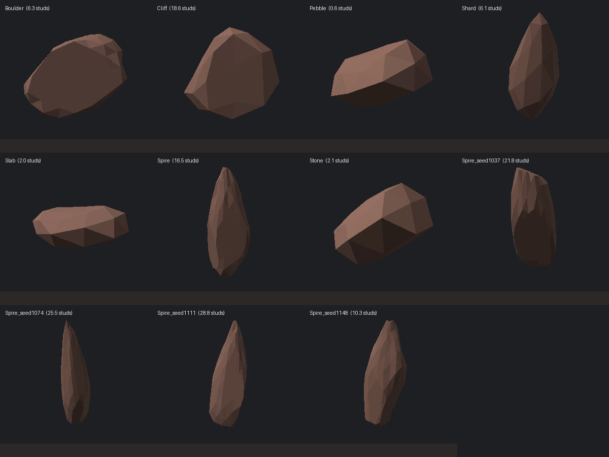

# RockKit — rochas procedurais para Roblox

Gerador de pedras facetadas que **combinam com o Terrain do Roblox**: a pedra usa
o mesmo material do terreno (`Rock`, `Slate`, `Sandstone`, `Basalt`…) e lê a cor
que o seu lugar já tem naquele material, então ela encosta no chão sem emenda.

Sete formatos simples e três formações montadas, de seixo de 0,4 stud a paredão
de 40 studs. Tudo determinístico: o mesmo `seed` devolve exatamente a mesma pedra.



*(Prévia renderizada pelo `tools/preview/run.py` — é a geometria real que sai no
Studio, sem textura.)*

---

## Instalação

**Com Rojo** (recomendado):

```bash
rojo serve          # usa o default.project.json da raiz
```

O módulo cai em `ReplicatedStorage.RockKit`.

**Sem Rojo:** crie um `ModuleScript` chamado `RockKit` em `ReplicatedStorage` e
cole dentro o conteúdo de [`build/RockKit.standalone.luau`](build/RockKit.standalone.luau)
— é o projeto inteiro num arquivo só.

---

## Uso rápido

```lua
local RockKit = require(game.ReplicatedStorage.RockKit)

-- uma pedra
RockKit.create({
    preset = "Spire",
    biome = "Canyon",
    cframe = CFrame.new(0, 10, 0),
    parent = workspace,
})

-- biblioteca de variações, para arrastar na mão ou clonar em runtime
RockKit.buildLibrary({ variants = 6, parent = game.ReplicatedStorage })

-- campo de pedras sobre o terreno
local pasta = Instance.new("Folder")
pasta.Parent = workspace

RockKit.scatter({
    center = Vector3.new(0, 0, 0),
    areaSize = Vector3.new(400, 800, 400), -- X/Z = área; Y = alcance do raycast
    count = 180,
    biome = "Canyon",
    presets = { "Pebble", "Stone", "Boulder", "Shard" },
    maxSlope = 40,
    terrainOnly = true,
    parent = pasta,
})
```

Dentro do Studio dá para rodar sem escrever script: os arquivos em
[`studio/`](studio) são feitos para colar na **Barra de Comandos**
(`View > Command Bar`) — gerar a biblioteca, espalhar no terreno e sincronizar as
cores do Terrain.

---

## Presets

| Preset    | Nome        | Altura típica | Para quê |
|-----------|-------------|---------------|----------|
| `Pebble`  | Seixo       | 0,4–1,2       | trilhas, margens, espalhar aos montes |
| `Stone`   | Pedra       | 1,3–3,6       | o tamanho mais usado em cenário |
| `Boulder` | Matacão     | 4–11          | bloco redondo, dá para subir |
| `Slab`    | Laje        | 1,2–4         | placa chata: degrau, plataforma |
| `Shard`   | Lasca       | 3,5–13        | fatia fina fincada em ângulo |
| `Spire`   | Agulha      | 10–32         | a torre pontuda da referência |
| `Cliff`   | Paredão     | 12–34         | massa de rocha para fechar o fundo |
| `Peak`    | Pico        | 16–40         | *formação*: várias agulhas + entulho na base |
| `Cluster` | Aglomerado  | 3–9           | *formação*: grupo de pedras médias |
| `Scree`   | Pedregulho  | 0,8–2,2       | *formação*: mancha de pedra miúda |

Os três últimos são **formações**: devolvem um `Model` com várias pedras
posicionadas juntas. Os outros devolvem um `MeshPart`.

---

## Como a cor combina com o terreno

Uma `Part` com `Material = Enum.Material.Rock` usa a mesma textura PBR que o
Terrain usa no material Rock. Se além disso a cor da Part for exatamente
`Terrain:GetMaterialColor(Enum.Material.Rock)`, a pedra encosta no terreno sem
emenda visível.

É isso que o kit faz, e por isso **`matchTerrain` vem ligado**: ele lê a cor que o
seu lugar já usa em vez de chutar uma. As paletas por bioma (`Canyon`,
`Mountain`, `Forest`, `Snow`, `Volcanic`) só entram como reserva, e decidem quais
materiais cada bioma sorteia.

Se quiser o contrário — puxar o **terreno** para o tom do bioma — existe
`RockKit.Palette.syncTerrain("Canyon")`. Ele **altera o Terrain do seu lugar** e
devolve as cores antigas para você conseguir voltar atrás.

---

## API

### `RockKit.create(options) -> Instance`

| Campo | Padrão | O que faz |
|---|---|---|
| `preset` | aleatório | nome da tabela acima |
| `seed` | aleatório | mesma seed = mesma pedra |
| `biome` | `"Canyon"` | paleta e materiais |
| `height` | faixa do preset | altura alvo em studs |
| `scale` | `1` | multiplica a altura sorteada |
| `material` / `color` | automático | força um material ou cor |
| `matchTerrain` | `true` | usa a cor do Terrain do lugar |
| `collisionFidelity` | do preset | `Box` nas pequenas, `Hull` nas grandes |
| `textureScale` | `8` | studs cobertos por um ladrilho da textura |
| `castShadow` | `true` | |
| `canCollide` | `true` | |
| `canTouch` | `false` | cenário não precisa disparar `Touched` |
| `useParts` | `false` | força o modo de blocos |
| `cframe` / `parent` / `name` | — | posição e destino |

Toda pedra sai com os atributos `RockKitPreset`, `RockKitSeed`, `RockKitBiome`,
`RockKitSize` e `RockKitBury`. O **pivô fica no centro da bounding box**, tanto no
`MeshPart` quanto no `Model`, então `PivotTo` se comporta igual nos dois casos.

### `RockKit.buildLibrary(options) -> Folder`

`presets`, `variants` (padrão 4), `seed`, `biome`, `matchTerrain`, `useParts`,
`parent`, `name`. Devolve uma `Folder` com uma subpasta por preset.

### `RockKit.scatter(options) -> { Instance }`

Além dos campos de biblioteca: `center`, `areaSize`, `count`, `minSpacing`,
`packing` (1 = nunca se tocam, 0.4 = amontoadas), `maxSlope` (graus),
`alignToNormal` (0 = sempre em pé, 1 = colada na normal do chão), `waterLevel`,
`scaleJitter`, `terrainOnly`, `ignore`, `parent`, `library`.

> `areaSize.Y` é o **alcance do raycast**, não a altura das pedras: ele precisa
> cobrir do ponto mais alto ao mais baixo do terreno na área, senão não acha chão.

### `RockKit.usesMeshes() -> boolean`

`true` quando as pedras saem como `MeshPart` facetado, `false` quando o engine não
tem `EditableMesh` e o kit caiu no modo de blocos.

---

## Desempenho

- `scatter` **clona** a partir de um punhado de variações em vez de gerar uma malha
  por pedra: 200 cópias da mesma malha custam muito menos para o engine e para o
  streaming do que 200 malhas únicas. Use `library` para reaproveitar o mesmo
  conjunto entre chamadas.
- Contagem de triângulos por pedra: 80 (`subdivisions = 1`) ou 320 (`= 2`).
- Colisão: `Box` nas pequenas, `Hull` nas grandes. Mexa em `collisionFidelity`
  só se precisar — `PreciseConvexDecomposition` custa caro em pedra de cenário.
- As pedras nascem `Anchored = true` e `CanTouch = false`.

---

## Como mexer no formato

Tudo que define a forma está em [`src/shared/RockKit/Presets.luau`](src/shared/RockKit/Presets.luau),
com um comentário por campo no topo do arquivo. Os que mais mudam o visual:

- `cleaves` / `cleaveDepth` — quantos planos de corte e quão fundo. Mais planos e
  corte mais fundo = mais poliedro, menos batata.
- `cleaveFamilies` / `cleaveJitter` — os planos saem de poucas direções-base, como
  as juntas de uma rocha de verdade. Poucas famílias e jitter baixo = faces longas
  e paralelas (é o que dá o visual das agulhas).
- `taperTop` / `taperCurve` — afinamento em direção ao topo.
- `amplitude` / `frequency` — o ruído que deforma a esfera antes do corte.
- `subdivisions` — 1 dá facetas grandes, 2 dá detalhe miúdo.

Depois de mexer, dá para ver o resultado **sem abrir o Studio**:

```bash
python3 tools/preview/run.py        # precisa de `luau` no PATH e de Pillow
python3 tools/bundle.py             # regera build/RockKit.standalone.luau
```

O `run.py` roda a geometria num interpretador Luau comum (com stubs das APIs da
Roblox), confere que as malhas estão sãs — sem NaN, normais unitárias e voltadas
para fora, winding consistente, bounding box centrada, base realmente plana, mesmo
seed gerando a mesma malha — e desenha `build/preview.png`.

---

## Estrutura

```
src/shared/RockKit/
  init.luau         API pública: create, buildLibrary, scatter
  Presets.luau      formatos e tamanhos  <- mexa aqui para mudar o visual
  Palette.luau      materiais e casamento de cor com o Terrain
  Shape.luau        geometria: esfera -> ruído -> afinamento -> clivagem
  MeshBuilder.luau  monta o MeshPart via EditableMesh
  PartBuilder.luau  reserva em Part/WedgePart quando não há EditableMesh
  Scatter.luau      espalhamento por raycast
  Noise.luau        ruído fractal determinístico
src/server/         exemplo (mostruário na frente do spawn)
studio/             scripts para colar na Barra de Comandos
tools/              bundler e prévia offline
```
